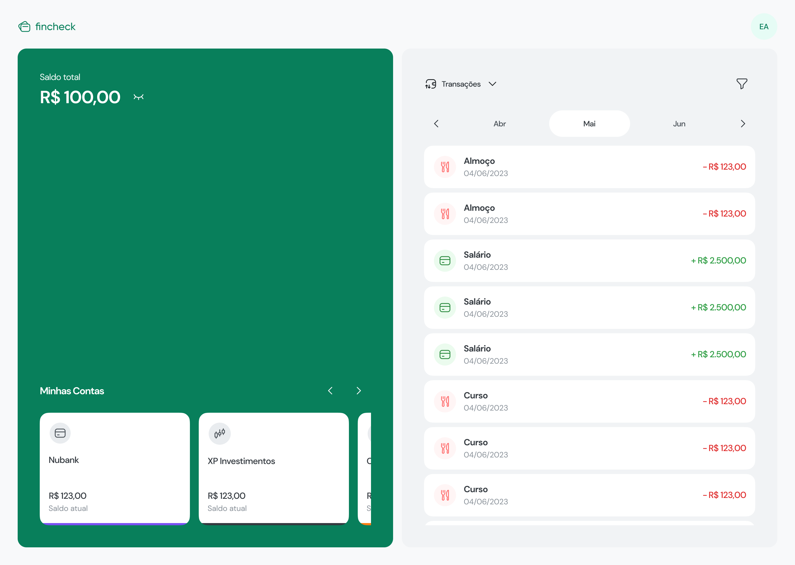
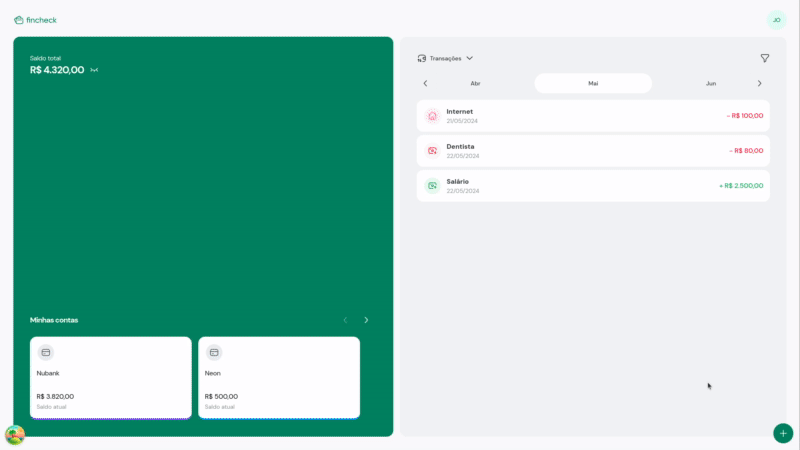

<h1 align="center">
  
</h1>

<br>

<p align="center">
  
</p>

## 💻 Projeto

O Fincheck é uma aplicação de organização financeira que permite a gestão eficiente de suas finanças pessoais através de múltiplas contas bancárias e transações categorizadas. Com o Fincheck, você pode visualizar suas finanças de forma clara e tomar decisões informadas sobre seus gastos e receitas.

## 🧐 Features

### Gestão de Contas Bancárias
- **Criar Contas Bancárias**: Adicione várias contas bancárias para melhor organizar suas finanças.
- **Editar Contas Bancárias**: Atualize as informações de suas contas bancárias conforme necessário.
- **Excluir Contas Bancárias**: Remova contas bancárias que não são mais necessárias.

### Gestão de Transações
- **Cadastrar Transações**: Adicione novas transações classificadas como "Receitas" ou "Despesas".
- **Editar Transações**: Modifique transações existentes para corrigir informações ou atualizar detalhes.
- **Excluir Transações**: Remova transações que não são mais relevantes ou foram inseridas incorretamente.
- **Atribuição de Contas**: Escolha em qual conta bancária a transação será realizada, proporcionando uma visão detalhada de suas finanças.

### Dashboard Financeiro
- **Saldo Total Disponível**: Visualize no dashboard o total disponível somando todas as suas contas bancárias. Esse recurso oferece uma visão consolidada de sua saúde financeira, facilitando o planejamento e a tomada de decisões.


## 📽 Demonstração

<p align="center">
  
</p>

## 🛠️ Installation Steps

1. Clone este repositório:

```bash
$ git clone https://github.com/lucianogmoraesjr/fincheck.git
```

2. Navegue até o diretório do projeto:

```bash
$ cd fincheck
```
#### Configurando o backend

Para iniciar a aplicação localmente é necessário ter [Node](https://nodejs.org), [pnpm](https://pnpm.io) e [docker](https://docker.com) previamente instalados.

1. Navegue até o diretório do backend:

```bash
$ cd api
```

2. Para instalar as dependências do projeto, rode o comando:

```bash
$ pnpm install
```

3. A aplicação precisa de um banco de dados [Postgres](https://postgresql.org), com o arquivo `docker-compose.yml` o processo de criação do container é automatizado, basta rodar o comando:

```bash
$ docker compose up -d
```

4. O arquivo `.env.example` contém todas as variáveis de ambiente preenchidas para rodar localmente, basta copiar e alterar o nome para `.env`:

```bash
$ cp .env.example .env
```

5. Execute as migrations:

```bash
$ pnpm prisma migrate deploy
```
#### Iniciando a API
Para iniciar a aplicação rode:

```bash
$ pnpm start:dev
```
Por padrão, a aplicação está rodando no endereço: `http://localhost:3333`

#### Configurando o frontend

1. Navegue até o diretório do frontend:

```bash
$ cd frontend
```

2. Para instalar as dependências do projeto, rode o comando:

```bash
$ pnpm install
```
#### Iniciando o frontend

Para iniciar a aplicação, rode o comando:

```bash
$ pnpm dev
```

A aplicação por padrão está rodando em: http://localhost:5173

## 🚀 Built with

Tecnologias utilizadas no projeto:

- [![NestJS][nestjs]][nestjs-url]
- [![React][react]][react-url]
- [![Vite][vite]][vite-url]
- [![TypeScript][typescript]][typescript-url]
- [![TailwindCSS][tailwind]][tailwind-url]
- [![React Hook Form][hook-form]][hook-form-url]
- [![React Query][react-query]][react-query-url]
- [![Prisma][prisma]][prisma-url]
- [![Zod][zod]][zod-url]

<!-- MARKDOWN LINKS & IMAGES -->
[react]: https://img.shields.io/badge/React%20-%20%2320232A?style=for-the-badge&logo=React
[react-url]: https://react.dev/
[vite]: https://img.shields.io/badge/Vite%20-%20%2320232A?style=for-the-badge&logo=Vite&logoColor=fff
[vite-url]: https://vitejs.dev
[typeScript]: https://img.shields.io/badge/TypeScript-20232A?style=for-the-badge&logo=TypeScript&logoColor=%233178C6
[typescript-url]: https://www.typescriptlang.org/
[hook-form]: https://img.shields.io/badge/React%20Hook%20Form%20-%2020232A?style=for-the-badge&logo=React%20Hook%20Form&logoColor=%23fff&color=%2320232A
[hook-form-url]: https://www.react-hook-form.com/
[zod]: https://img.shields.io/badge/Zod%20-%20%2320232A?style=for-the-badge&logo=zod
[zod-url]: https://zod.dev/
[prisma]: https://img.shields.io/badge/Prisma-20232A?style=for-the-badge&logo=prisma&logoColor=fff
[prisma-url]: https://www.prisma.io/
[nestjs]: https://img.shields.io/badge/NestJS%20-%20%2320232A?style=for-the-badge&logo=nestjs
[nestjs-url]: https://nestjs.com
[react-query]: https://img.shields.io/badge/React%20Query-20232A?style=for-the-badge&logo=reactquery&logoColor=fff
[react-query-url]: https://tanstack.com/query/latest/docs/framework/react/overview
[tailwind]: https://img.shields.io/badge/TailwindCSS-20232A?style=for-the-badge&logo=tailwindcss&logoColor=fff
[tailwind-url]: https://tailwindcss.com
